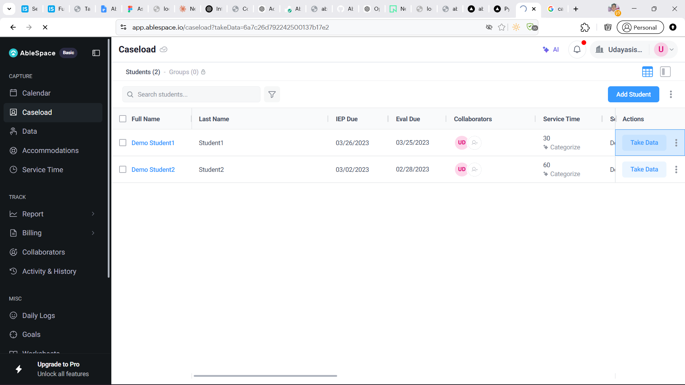
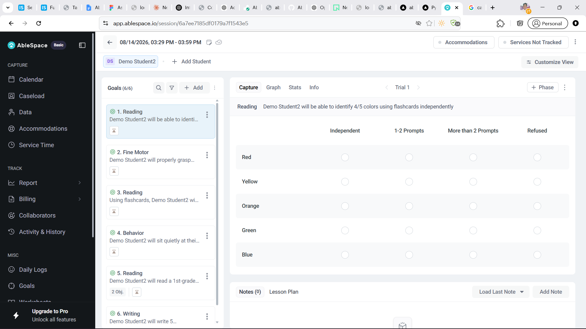
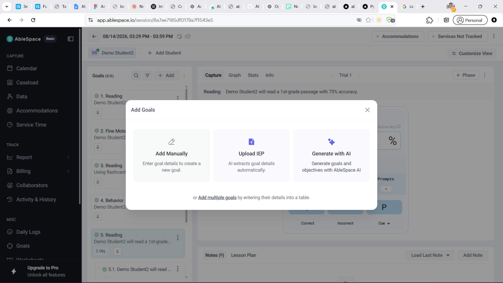

# My understanding of AbleSpace Take Data

I explored the Caseload and Take Data screens in AbleSpace. My understanding is that this feature helps teachers or therapists record how a student performed during a session.

## How I think the flow works

1. I open **Caseload** and find the student.
2. I click **Take Data** for that student.
3. I choose one of the student's goals from the list.
4. I record the student's response while I am working with them.
5. I can add notes, then later look at graphs and stats to understand progress.

The Caseload page is the starting point. It shows students and useful information such as IEP dates, collaborators, and service time. The **Take Data** button makes it easy to start recording a session for the correct student.

## Recording data for a goal

Each student can have several goals, such as Reading, Fine Motor, Behaviour, or Writing. The goals are kept in the left panel, so I can move between them without leaving the session.

For some goals, data is recorded item by item. In the example below, the student is asked to identify colours. For every colour, I can record whether the student did it independently, needed some prompts, needed more help, or refused.

I think this is useful because it records more than just right or wrong. It also shows how much support the student needed. Over time, this can show whether the student is becoming more independent.

For other goals, the screen uses controls such as **Correct**, **Incorrect**, and **Cue**, along with accuracy and prompt counts. This seems designed for goals where the user is recording many attempts during a session.

The **Undo** button is also useful because the person recording data may accidentally press the wrong option while working with the student.

## Creating goals

Before data can be collected, the student needs goals. AbleSpace provides a few ways to add them:

- Add a goal manually.
- Upload an IEP and extract details.
- Generate goals with AI.
- Add multiple goals in a table.

This gives users flexibility. Someone can enter one small goal themselves, while another person can save time by uploading an existing IEP or adding many goals together.

## What I think works well

- The path from a student to **Take Data** is clear.
- The selected student's goals are visible during the session.
- Different goal types can use different ways of recording data.
- Notes, graphs, and stats are close to the data-entry area.
- Undo helps avoid mistakes during a busy session.

## Things that could be clearer

- A new user may not understand why some goals use a response table while others use Correct, Incorrect, and Cue buttons.
- Terms like **Trial**, **Phase**, and **Prompted** may need short help text for people who are new to the product.
- It is not immediately clear whether data saves automatically or needs a separate save action.
- When there are many goals, the goal list could be easier to search or group.

Overall, I understand Take Data as the part of AbleSpace that turns what happened in a student session into structured progress data. The data can then be used to track improvement and support future planning.
